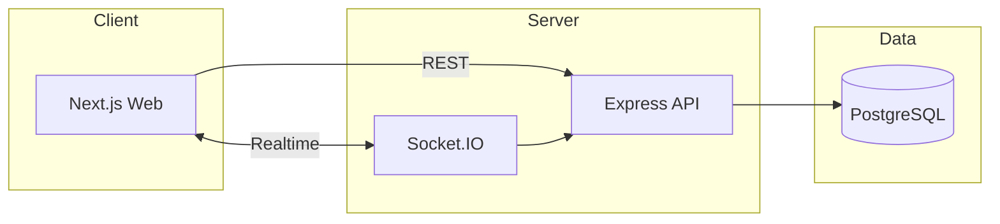

<div align="center">

<!-- ═══════════════════════════════════════════════════════════
     HERO BANNER — MediCore × clinical teal
     ═══════════════════════════════════════════════════════════ -->


<br/>

### Hospital management for real clinical workflows

Patient portal · Appointments · Records · Pharmacy · Lab & Imaging · Wards · Billing · Role-based ops  
— one local monorepo, built entirely on a free & open-source stack.

<br/>

<!-- ═══════════════════════════════════════════════════════════
     STICKER / BADGE STRIP
     ═══════════════════════════════════════════════════════════ -->

[](https://www.typescriptlang.org/)
[](https://nextjs.org/)
[](https://nodejs.org/)
[](https://www.postgresql.org/)
[](https://turbo.build/)

<br/>

[](#license)
[](#-workspace)
[](#-features)
[](#-tech-stack)
[](#-tech-stack)

<br/>

[](https://github.com/Bixal99/HMS)
[](https://github.com/Bixal99/HMS/fork)
[](https://github.com/Bixal99/HMS/issues)

</div>

---

## ✨ At a Glance

<table>
<tr>
<td width="33%" align="center">

### 🏥 Clinical Core
SOAP notes · vitals · diagnoses  
prescriptions · lab & imaging orders

</td>
<td width="33%" align="center">

### ⚡ Live Ops
Socket.IO queues · ward boards  
critical lab alerts — no polling

</td>
<td width="33%" align="center">

### 🔐 Role Portals
Admin · Doctor · Nurse · Reception  
Pharmacy · Lab · Billing · Patient

</td>
</tr>
</table>

**Core flow**

```text
Register / Walk-in  →  Booking & Check-in  →  Doctor Queue
        ↓                                         ↓
   Patient Portal                    Consultation & Charting
                                              ↓
                    Pharmacy / Lab / Imaging fulfillment
                                              ↓
                                   Billing & Insurance
```

---

## 🧩 Tech Stack

<div align="center">

### Frontend
<br/>

[](https://skillicons.dev)

| | Tool | Role |
|:---:|:---|:---|
| ⬛ | **Next.js 16** | App Router · patient portal · staff dashboards |
| 🔷 | **TypeScript** | End-to-end type safety across workspaces |
| 💨 | **Tailwind CSS v4** | Utility-first clinical UI |
| 🧩 | **shadcn/ui · Radix** | Accessible primitives |
| 🔄 | **TanStack Query** | Server state · caching · refetch |
| ✨ | **GSAP + Anime.js** | Motion & presence |
| 📊 | **Chart.js** | Clinical & financial dashboards |
| 🔌 | **Socket.IO Client** | Live boards & alerts |

<br/>

### Backend & Data
<br/>

[](https://skillicons.dev)

| | Tool | Role |
|:---:|:---|:---|
| 🟢 | **Node.js · Express 5** | REST API · rate limits · uploads |
| 🔺 | **Prisma 7** | Typed ORM · migrations · Studio |
| 🐘 | **PostgreSQL** | System of record |
| 🔴 | **Socket.IO** | Realtime fan-out to web clients |
| ✉️ | **Resend** | Staff invites · contact form email |
| 🧾 | **React-PDF** | Document generation |

<br/>

### Auth · Shared · Tooling
<br/>

[](https://skillicons.dev)

| | Tool | Role |
|:---:|:---|:---|
| 🔑 | **Auth.js v5** | Database sessions (Prisma adapter) |
| 🛡️ | **CASL** | Ability-based RBAC (`packages/shared-auth`) |
| 📦 | **Zod** | Shared validators for web + API |
| 🚀 | **Turborepo** | Parallel monorepo pipelines |
| 🧪 | **TypeScript · Prettier** | Lint & format across workspaces |

</div>

---

## 🌟 Features

<table>
<tr>
<td valign="top" width="50%">

#### 👤 Patient Portal
Dashboard · symptom-guided or direct booking · appointment timeline · read-only records, invoices & lab results

#### 🛎️ Reception
Self-service or walk-in registration · booking · check-in · live appointment queue

#### 🩺 Clinical
Versioned SOAP notes · vitals · diagnoses · prescriptions · lab & imaging ordering · consultations

#### 💊 Pharmacy & Lab
FEFO batch dispensing · shared kanban fulfillment · critical-result alerts to ordering doctors

</td>
<td valign="top" width="50%">

#### 🛏️ Wards
Realtime bed occupancy · admission / transfer / discharge · checklist-driven discharge flow

#### 💳 Billing
Auto-aggregated invoices (consults, dispenses, labs, bed-days) · payments · insurance claims

#### 🛠️ Admin & Ops
Staff onboarding · departments & specialties · inventory & equipment · reporting · audit logging · settings

#### 📡 Realtime
Doctor queue · ward occupancy · pharmacy/lab boards · critical labs — pushed instantly over Socket.IO

</td>
</tr>
</table>

<div align="center">

### Roles at a glance


</div>

---

## 📋 Prerequisites

| Requirement | Notes |
|:---|:---|
| **Node.js ≥ 20** · **npm ≥ 10** | Engines enforced at the monorepo root |
| **PostgreSQL** | Local instance (default `5432`) or Docker Compose (`5433`) |
| **Resend API key** *(optional)* | Staff invite emails + contact form — free tier works |

---

## 🚀 First-Time Setup

```bash
# 1. Install workspaces
npm install

# 2. Environment
cp apps/api/.env.example apps/api/.env
cp apps/web/.env.example apps/web/.env
# Fill DATABASE_URL (must match in both), WEB_ORIGIN, optional RESEND_* keys

# 3. Database
npm run db:migrate
npm run db:seed      # demo staff, catalogs, wards, inventory, settings

# 4. Develop
npm run dev
```

| App | URL |
|:---|:---|
| 🌐 **Web** | [http://localhost:3000](http://localhost:3000) |
| 🔌 **API** | [http://localhost:4000](http://localhost:4000) |

> **Demo seed password:** `Demo@1234`  
> Example staff emails include `admin@medicore.local`, `doctor@medicore.local`, `receptionist@medicore.local`, and other role accounts created by the seed.

Environment templates live in `apps/api/.env.example` and `apps/web/.env.example`. Copy to `.env` (gitignored) — **never commit real secrets**.

---

## 🔐 Environment Variables

| Variable | Where | Purpose |
|:---|:---|:---|
| `DATABASE_URL` | `apps/api`, `apps/web` | PostgreSQL connection — **must be identical** in both |
| `PORT` | `apps/api` | API listen port (default `4000`) |
| `WEB_ORIGIN` | `apps/api` | CORS + Socket.IO allowed origin |
| `NEXT_PUBLIC_API_URL` | `apps/web` | Browser → API base URL |
| `RESEND_API_KEY` | `apps/api` | Outgoing email *(optional)* |
| `RESEND_FROM_EMAIL` | `apps/api` | From header for Resend |
| `HOSPITAL_CONTACT_EMAIL` | `apps/api` | Contact-form destination |

---

## 📜 Scripts

| Command | Purpose |
|:---|:---|
| `npm run dev` | Start web + API together (Turborepo) |
| `npm run build` | Production build — all workspaces |
| `npm run lint` | Lint all workspaces |
| `npm run db:migrate` | Apply Prisma migrations |
| `npm run db:seed` | Seed demo users, catalogs, wards, inventory |
| `npm run db:studio` | Open Prisma Studio |

---

## 🗂️ Workspace

```text
medicore/
├── apps/
│   ├── web/                 # Next.js — portal, staff UI, marketing
│   └── api/                 # Express + Prisma + Socket.IO
├── packages/
│   ├── shared-types/        # Shared TypeScript DTOs
│   ├── shared-validators/   # Zod schemas (web + api)
│   └── shared-auth/         # Session helpers + CASL abilities
├── .github/workflows/       # CI
├── turbo.json
└── package.json
```

<div align="center">



</div>

---

## 🧭 Development Notes

MediCore is built as a **scoped monorepo**: foundation & theming → auth / RBAC → clinical & operational modules in dependency order → polish (realtime boards, catalogs, staff onboarding).

Shared contracts live in `packages/*` so the web app and API stay aligned on types, validators, and abilities.

---

## 📄 License

**Private / unpublished** — for local MediCore development.

---

<div align="center">


<br/>

**[⬆ Back to top](#---at-a-glance)**

<br/>

<sub>MediCore · HMS · Next.js · Express · Prisma · PostgreSQL · Socket.IO</sub>

</div>
